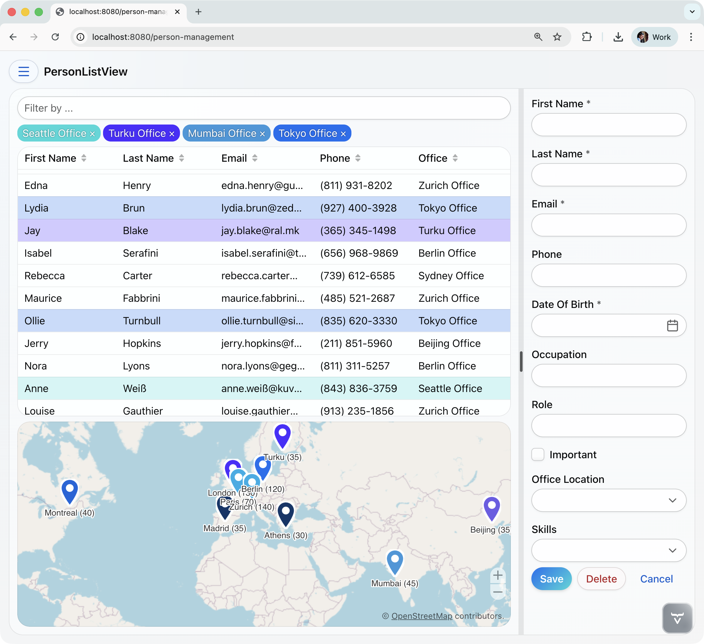

# vaadin-jug-demo

A demo-friendly **Vaadin + Spring Boot** app to showcase how you can build modern, reactive UIs in pure Java.
Run it locally, explore the examples, and use it as a starting point for your own projects.



---

## 🎯 Why this project?
Most backend developers "fly blind" behind JSON responses and log files. This demo accompanies the talk **"Your Backend Deserves a Face"**.

It shows how to:
* **Stop the Blind Flight:** Visualize and interact with your data in real-time.
* **Kill the Plumbing:** Build UIs without writing a single REST controller or DTO. Go Full-Stack!
* **Stress-Test your Logic:** See how your filters, sorting, and validations behave under real conditions.

## Tech Stack

* **Java 21**
* **Spring Boot 4.0.2**
* **Vaadin 25.0** (Flow / server-side Java UI)
* **Spring AI 2.0** (OpenAI integration)
* **Spring Data JPA** with H2 in-memory database
* **Vaadin Collaboration Engine** for real-time multi-user features
* **Vaadin TestBench** (JUnit 5 + Selenium) for browser-based integration tests
* **Maven 3.8.4+** (Maven Wrapper included)

---

## Quick Start

### Prerequisites

* JDK 21+
* Internet access (for frontend dependencies & AI calls)
* Maven not required globally — use included `./mvnw`
* **Optional:** An OpenAI API key (only needed for the AI chat views)

> The app starts and works fine **without an API key** — all views except AI Chat and AI Chat & Context are fully functional. No key needed to explore grids, charts, forms, or the map.

---

### 1. Run in Dev Mode

```bash
./mvnw
```

Then open: [http://localhost:8080](http://localhost:8080)

> Includes live reload and on-the-fly frontend builds.

---

### 2. Run from IDE

* Import as **Maven** project
* Run `Application.java` (Spring Boot main class)

Tip: Use **Hotswap Agent** to instantly see code changes in your browser.

---

### 3. Production Build & Run

```bash
./mvnw -Pproduction clean package
java -jar target/*.jar
```

---

## What's Inside

### Main Views

| View | Route | Description |
|------|-------|-------------|
| **Hello World** | `/` | Simple greeting form with notification |
| **Person Management** | `/person-management` | CRUD grid with filter, office location map with colored markers, edit form with skills and office assignment |
| **Person Dashboard** | `/persons-dashboard` | Charts for team skills, age distribution, and role distribution |
| **Person REST Service** | `/person-rest-service` | Grid displaying persons fetched from REST API (`/api/persons`) |

### More Examples (under "Others" submenu)

| View | Route | Description |
|------|-------|-------------|
| **Person Form** | `/person-form` | Basic form layout with personal information fields |
| **CRUD Example** | `/crud-example` | Standard split-layout CRUD with URL-based routing |
| **Collaborative CRUD** | `/collaborative-crud-example` | Real-time multi-user editing with Collaboration Engine |
| **Data Grid** | `/data-grid` | Advanced grid with filterable columns and custom renderers |
| **Slow Grid** | `/slow-grid` | Async data loading with spinner (demonstrates async patterns) |
| **External Component** | `/external-component` | Third-party Web Component integration |
| **Chat** | `/chat` | Real-time multi-channel chat with Collaboration Engine |
| **AI Chat** | `/chat-ai` | Chat with OpenAI, streamed as markdown |
| **AI Chat & Context** | `/chat-ai-with-context` | AI chat with tool support for conference talks context |

---

## Data Model

```
SamplePerson ──@ManyToMany──▷ Skill
     │                         (Java, Python, TypeScript, Spring,
     │                          Docker, Kubernetes, AWS, REST,
     @ManyToOne                 Kafka, Git, Vaadin)
     │
     ▼
OfficeLocation
  (15 offices worldwide: Zurich, London, Berlin,
   San Francisco, Tokyo, Paris, Seattle, Sydney,
   Mumbai, Montreal, Madrid, Beijing, Turku,
   Johannesburg, Athens)
```

The H2 database is initialized with **1000 sample persons**, each assigned to an office location and 1-4 skills. Initialization only runs when the database is empty.

---

## Project Structure

```
src/main/java/org/vaadin/demo/
 ├─ Application.java              # Spring Boot entry point (@Push, DB init)
 ├─ data/                         # JPA entities & repositories
 │   ├─ AbstractEntity.java       #   Base entity (ID, version)
 │   ├─ SamplePerson.java         #   Person entity
 │   ├─ Skill.java                #   Skill entity
 │   ├─ OfficeLocation.java       #   Office location with coordinates
 │   ├─ Talk.java                 #   Conference talk (in-memory POJO)
 │   └─ *Repository.java          #   Spring Data repositories
 ├─ services/
 │   └─ SamplePersonService.java  # Business logic for persons & offices
 └─ views/
     ├─ MainLayout.java           # Root AppLayout with drawer navigation
     ├─ helloworld/               # Hello World view
     ├─ personlist/               # Person Management (grid + map + form)
     ├─ restperson/               # REST service view
     ├─ dashboard/                # Charts dashboard
     └─ others/                   # Additional example views
         ├─ chat/                 #   Chat & AI chat views
         ├─ crud/                 #   CRUD & collaborative CRUD
         ├─ datagrid/             #   Data grid with filters
         ├─ externalcomponent/    #   Web Component integration
         ├─ personform/           #   Basic person form
         └─ slowgrid/             #   Async loading demo

src/main/resources/
 ├─ application.properties        # Config (port, AI keys, JPA settings)
 ├─ data.sql                      # Sample data (offices, skills, persons)
 └─ META-INF/resources/           # Static web resources
     ├─ styles.css                #   Global stylesheet (imports view CSS)
     ├─ main-layout.css           #   Drawer and layout styles
     └─ views/                    #   Per-view stylesheets
         ├─ crud-example-view.css
         ├─ gridwith-filters-view.css
         ├─ chat-view.css
         ├─ data-grid-view.css
         └─ slow-grid-view.css
```

---

## Optional: Enable AI Chat

To use the AI-powered chat views, provide your OpenAI key:

```bash
export OPENAI_API_KEY=sk-...
```

Without this key, all other views work normally. Only the AI Chat and AI Chat & Context views require it.

---

## Troubleshooting

* Set `vaadin.frontend.hotdeploy=true` in `application.properties` to enable hot deploy of frontend code.
* Run `mvn vaadin:dance` to clean and rebuild the frontend code.

---

## Useful Links

* [Vaadin Docs](https://vaadin.com/docs)
* [Spring Boot Docs](https://docs.spring.io/spring-boot/docs/current/reference/html/)
* [Spring AI Docs](https://docs.spring.io/spring-ai/reference/)
